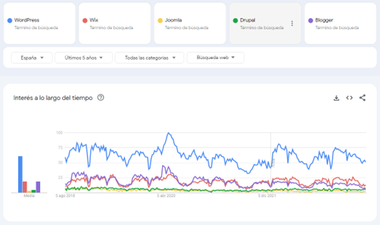
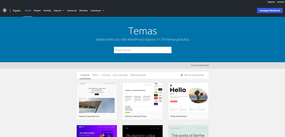
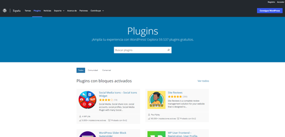

# Pero... ¿Qué es WordPress?

¡Excelente pregunta! En el contexto de este curso, WordPress se refiere a WordPress.org, una plataforma de gestión de contenidos (CMS, por sus siglas en inglés) de código abierto que te permite crear y administrar sitios web de manera eficiente y personalizada. Actualmente, impulsa más del 60% de los sitios web generados con gestores de contenidos (CMS).

Como comenta Fernando Tellado en su libro – WordPress 6. Creación web gratis (SOCIAL MEDIA). ANAYA MULTIMEDIA. –

> “Siempre digo que si le pregunto a mi pescadero sobre qué es WordPress no sabrá decirme qué es, pero, sin embargo, a diario ve cientos o miles de páginas web que están creadas con WordPress sin saberlo. Y esa es parte de la belleza de esta aplicación: no necesitas saber que existe para disfrutar de sus ventajas”

WordPress, con una cuota de mercado de más del 43%, se ha convertido en la opción preferida para millones de usuarios en todo el mundo debido a su facilidad de uso, flexibilidad y escalabilidad. Es ampliamente utilizado para crear desde simples blogs hasta sitios web complejos, tiendas online, portafolios y mucho más.

!!!note Información
    Puedes encontrar más información sobre los CMS:
    
    - https://juanarmada.com/los-sistemas-gestores-de-contenidos-cms/
    
    - https://juanarmada.com/ventajas-de-utilizar-un-cms-para-implementar-una-web-de-empresa/
    
    - https://juanarmada.com/guia-para-la-seleccion-de-un-cms-para-nuestra-empresa/

## Tendencia

Te tiendo en cuenta la tendencia de cada una de ellas en los últimos 5 años y la cuota de mercado (Fig 1) de WordPress (solo en España), la mejor opción para crear una web es WordPress.org.

!!!note Información
    Puedes encontrar la tendencia a nivel mundial, actualizada, de los diferentes CMS en:
    
    - https://trends.google.es/trends/explore?date=today%205-y&q=WordPress,Wix,Joomla,Drupal,Blogger&hl=es

## Las ventajas de utilizar WordPress

Una de las **ventajas** clave de WordPress es su enfoque en la **facilidad de personalización**. Puedes elegir entre una amplia variedad de temas o themes (cerca de 12.000) y complementos o plugins (cerca de 60.000) para adaptar tu sitio web a tus necesidades específicas, sin requerir conocimientos avanzados de programación.

Además, WordPress cuenta con una comunidad muy activa y colaborativa de desarrolladores y usuarios que contribuyen con la mejora y expansión de la plataforma. Esto significa que siempre tendrás acceso a actualizaciones, nuevas características y soporte técnico.

> WordPress es una potente herramienta para el marketing digital que te permitirá crear un sitio web profesional y atractivo, gestionar tu contenido de manera eficiente y aprovechar diversas funcionalidades para alcanzar tus objetivos online.
