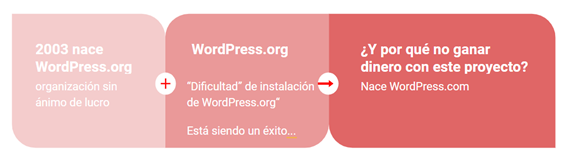
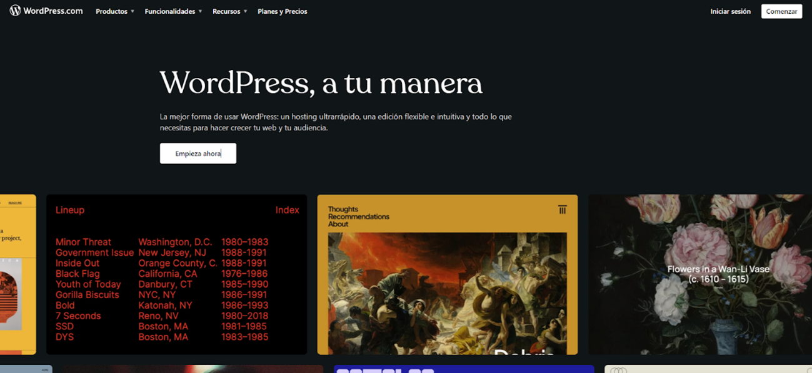
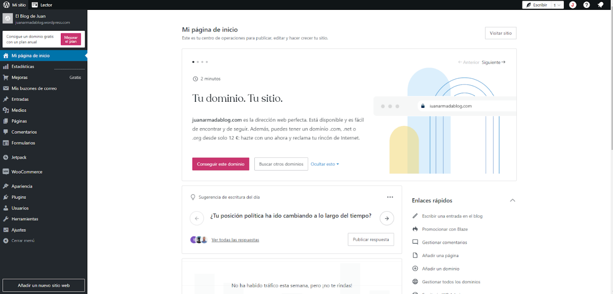
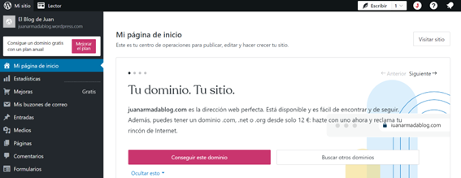

# Un poco de historia

La belleza de WordPress radica en su facilidad de uso y en su enfoque en la personalización. No necesitas ser un experto en programación para crear un sitio web impresionante con WordPress. Con su interfaz intuitiva y amigable, puedes seleccionar entre una amplia gama de temas y complementos que te permiten adaptar tu sitio web a tus necesidades y objetivos específicos. Ya sea que busques un diseño elegante, una funcionalidad especializada o una forma de monetizar tu sitio, WordPress te proporciona las herramientas necesarias para lograrlo.

Además, como he comentado en el punto anterior, WordPress cuenta con una comunidad vibrante y activa de desarrolladores y usuarios que contribuyen con su mejora y expansión continua. Esto significa que siempre tendrás acceso a actualizaciones, nuevas características y soporte técnico, lo que te permitirá mantener siempre actualizado y seguro tu sitio web.

## El origen

WordPress nació en 2003, fruto de la inquietud de dos jóvenes programadores, Matt Mullenweg y Mike Little. Surgió como una respuesta a su deseo de dar un futuro amplio a su aplicación favorita de creación de blogs, b2/cafelog.

> B2/cafelog fue un precursor de WordPress, reconocido como una herramienta elegante de noticias y blogs, también llamada logware. Los usuarios podían ingresar contenido y publicarlo instantáneamente en sus páginas haciendo clic en “blog this”

Desde su creación en 2003, ha evolucionado para convertirse en mucho más que un simple sistema de blogging. Hoy en día, WordPress es utilizado por millones de personas en todo el mundo para crear una amplia variedad de sitios web, incluyendo blogs, sitios corporativos, tiendas online o ecommerce, portafolios y mucho más.

> La versión inicial, 0.70, vio la luz el 27 de mayo de 2003, marcando el comienzo de una revolución en la creación web. En menos de un año, el 4 de enero de 2004, la versión 1.0, dedicada al músico de jazz Miles Davis, se lanzó, estableciendo la tradición de nombrar cada versión mayor en honor a un destacado jazzista.

!!!note "Información"
    Puedes encontrar información sobre el 20 aniversario de WordPress:
    
    - https://juanarmada.com/20-aniversario-de-wordpress/
    
    - https://es.wordpress.org/about/history/
    
    - https://wordpress.org/book/

## El CMS más usado

Como ya supondrás, hoy en día podemos pensar que WordPress es el mejor [gestor de contenidos dinámico (CMS)](https://juanarmada.com/los-sistemas-gestores-de-wp-content/uploadss-cms/) del mundo, y uno de los más utilizados, con diferencia, llegando actualmente a superar el 63% de cuota de mercado. Y además es [open source](https://es.wikipedia.org/wiki/C%C3%B3digo_abierto) y completamente gratuito. ¿Qué más quieres?

WordPress, como sabes, empezó en 2003 como software para la creación de blogs, pero con el tiempo se ha convertido en un CMS a tener en cuenta para la creación de cualquier web corporativa.

De hecho, este fabuloso CMS siguió su andadura en el mundo digital, y dos años después de su creación, aparece como una plataforma de alojamiento gestionada. Perfecta para aquellos que desean iniciarse en la creación de blogs sin complicaciones, nace WordPress.com, la vertiente alojada de WordPress, ofrece una entrada amigable al mundo digital. WordPress.com proporciona un entorno donde el alojamiento y la infraestructura técnica son manejados por Automattic, la empresa detrás de WordPress.

Con la posibilidad de obtener un dominio gratuito o conectar uno personalizado mediante tarifas, WordPress.com permite a los usuarios dar vida a sus ideas en minutos. La facilidad de uso es una de sus mayores fortalezas, **proporcionando a los principiantes la oportunidad de comenzar sin preocuparse por la configuración técnica**.

A pesar de sus ventajas, WordPress.com tiene ciertas limitaciones en términos de personalización avanzada. Mientras que puedes seleccionar entre una variedad de temas y realizar ajustes básicos, la instalación de plugins y la personalización profunda pueden estar restringidas en comparación con la alternativa autohospedada, WordPress.org.

**WordPress.com ofrece una entrada sin complicaciones al mundo de la creación de contenido online**, ideal para aquellos que desean comenzar rápidamente con un blog o sitio web básico sin sumergirse en detalles técnicos.

## WordPress.org vs. WordPress.

Al adentrarse en el fascinante mundo de WordPress, es esencial comprender la distinción entre dos opciones clave: WordPress.com y WordPress.org. Estas dos variantes ofrecen enfoques distintos para la creación y gestión de sitios web, cada uno con sus propias ventajas y consideraciones. En esta exploración, desglosaré, para dejarlo más claro, las diferencias fundamentales entre WordPress.com y WordPress.org, desde el alojamiento hasta la personalización y la flexibilidad. Ya sea que estés comenzando tu viaje online o busques un control total sobre tu presencia en Internet, esta comparación te ayudará en la elección que mejor se adapte a tus necesidades y metas.

La distinción entre WordPress.com y WordPress.org es significativa para entender cómo abordar la creación y gestión de un sitio web con WordPress. No te preocupes si en los siguientes puntos aparecen conceptos desconocidos para ti, los abordaré en la siguiente lección.

- **WordPress.com**:
    - **Hosted Solution**: WordPress.com es una plataforma de alojamiento gestionada. Esto significa que tu sitio se aloja en los servidores de WordPress.com, y no necesitas preocuparte por la gestión técnica del alojamiento.
    - **Dominio Gratuito y Pagado**: Puedes obtener un dominio gratuito como “tudominio.wordpress.com” o conectar un dominio propio pagando una tarifa.
    - **Facilidad de Uso**: Es fácil de usar y es ideal para principiantes que desean un enfoque simple para iniciar un blog o sitio web sin preocuparse por la infraestructura técnica.
    - **Limitaciones en Personalización**: Aunque puedes personalizar temas y funciones básicas, hay limitaciones en la instalación de plugins y la personalización avanzada.
    - **Planes de Pago**: Ofrece planes gratuitos con publicidad de WordPress.com, así como planes de pago que eliminan anuncios y proporcionan funciones adicionales.
    

- **WordPress.org**:
    - **Autohospedado**: Con WordPress.org, descargas el software y lo instalas en tu propio servidor web. Esto te proporciona total control sobre tu sitio.
    - **Dominio Propio**: Necesitas comprar y gestionar tu propio dominio y servidor web (esto lo trabajaremos en la siguiente unidad). Esto te da la libertad de tener una dirección web personalizada.
    - **Flexibilidad Total**: Puedes instalar temas personalizados (themes), plugins y realizar cambios en el código fuente. La flexibilidad es casi ilimitada.
    - **Responsabilidad del Usuario**: Requiere más conocimientos técnicos y responsabilidad para gestionar el alojamiento, actualizaciones de seguridad y otras tareas administrativas. Aunque esto cada vez es más fácil y trasparente para el usuario.
    - **Sin coste del Software**: El software de WordPress es gratuito, aunque necesitarás pagar por el alojamiento (hosting) y el dominio.

En definitiva, WordPress.com es ideal para principiantes que buscan una solución fácil y rápida sin preocuparse por la gestión técnica. Mientras que, WordPress.org es la elección para aquellos que buscan total control, flexibilidad y están dispuestos a asumir la responsabilidad técnica.

!!!note "Información"
    Puedes encontrar más información sobre las diferencias entre .org y .com de WordPress en:
    
    - https://juanarmada.com/diferencias-entre-wordpress-com-y-wordpress-org/

La elección entre WordPress.com y WordPress.org depende de tus necesidades, nivel de experiencia y el grado de control que desees tener sobre tu sitio web.

En este inicial recorrido, hemos sumergido nuestras mentes en la fascinante historia de WordPress, desentrañando sus orígenes, evolución y destacando las razones que lo han elevado a ser la elección predilecta en la creación de sitios web. Hemos profundizado en los conceptos esenciales que serán la base para aprovechar al máximo este robusto sistema de gestión de contenidos (CMS). Además, aclaramos las diferencias cruciales entre WordPress.org y WordPress.com. Este conocimiento nos prepara para el emocionante viaje que emprenderemos juntos. Como cierre, les invito a sumergirse aún más en este universo visualizando el video de presentación que acompaña a este tema. ¡Bienvenidos al apasionante mundo de WordPress!

!!!note "Video"

    Y para finalizar vamos a ver un video presentación del curso:
    
    

    <iframe width="560" height="315" src="https://www.youtube.com/embed/N-ylKIJMO4U?si=n-QSO07EhXzoi32v" title="YouTube video player" frameborder="0" allow="accelerometer; autoplay; clipboard-write; encrypted-media; gyroscope; picture-in-picture; web-share" referrerpolicy="strict-origin-when-cross-origin" allowfullscreen></iframe>
    
